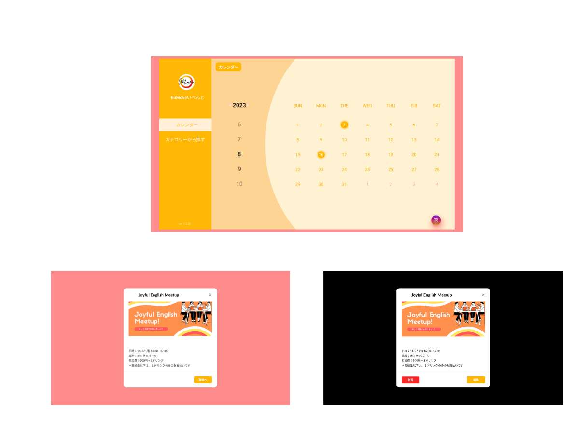
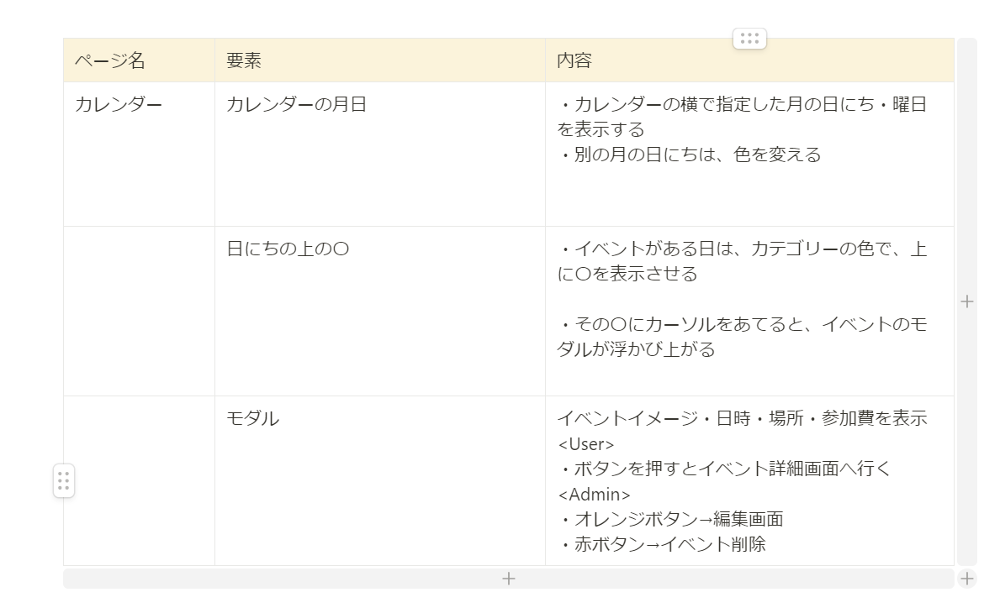
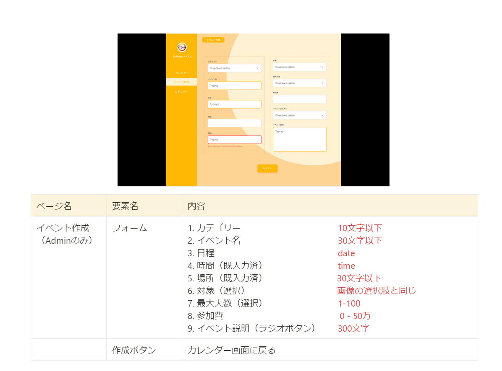

# EventCalendar

# 1\. アプリ開発の背景

## 1\. アプリの解決したい課題

- Instagram でイベントのスケジュールを一度投稿すると、変更がある際にその投稿を消さなければ修正することができない
- イベントのスケジュールを Instagram に投稿しても、その投稿が埋もれる可能性が高いため、参加者がイベントのスケジュールを把握しにくい。
- 申し込みのリンクを参加者が見つけにくいため、参加者獲得のチャンスが減っている

## 2\. アプリの世界観

- 大切な縁をつくり、その出会いが心動かす瞬間をつくりたい。
- 温かい人と出会えるイベントをつくりたいため、温かみのある色（オレンジベース）を使用したい

# 2\.　機能

## 1\. 基本機能

## 2\. カレンダー

## 3\. イベント詳細

## 4\. 申込フォーム

## 5\.　イベント作成

