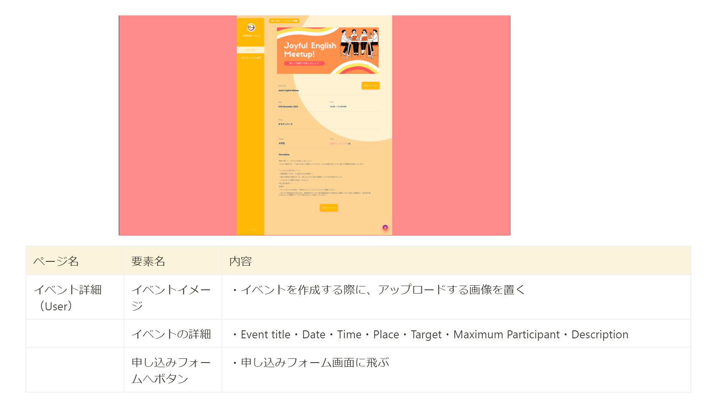
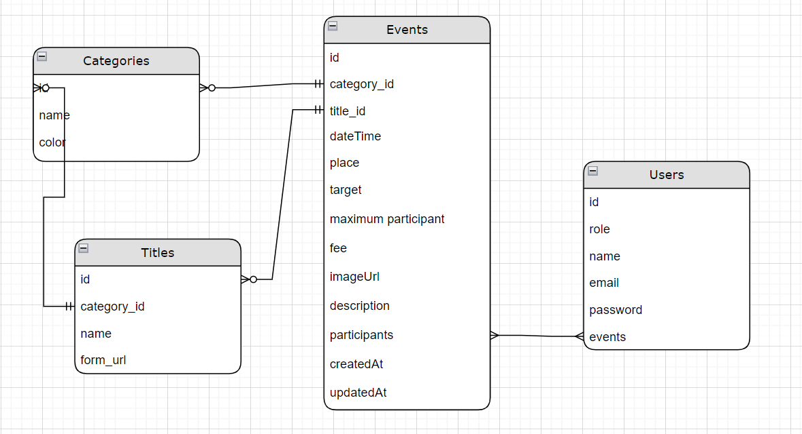

# EventCalendar

# 1\. アプリ開発の背景

## 1\. アプリの解決したい課題

- Instagram でイベントのスケジュールを一度投稿すると、変更がある際にその投稿を消さなければ修正することができない
- イベントのスケジュールを Instagram に投稿しても、その投稿が埋もれる可能性が高いため、参加者がイベントのスケジュールを把握しにくい。
- 申し込みのリンクを参加者が見つけにくいため、参加者獲得のチャンスが減っている

## 2\. アプリの世界観

- 大切な縁をつくり、その出会いが心動かす瞬間をつくりたい。
- 温かい人と出会えるイベントをつくりたいため、温かみのある色（オレンジベース）を使用したい

# 2\.　機能

## 1\. 基本機能

## 2\. User

### 1\. カレンダー

### 2\. イベントの詳細

### 3\. 申込フォーム

## 2\.　 Admin

### 1\. イベント編集（Category）

### 2\. イベント編集(Title)

### 3\. イベント編集(Event)

# 3\. データベース設計

## 1\. 全体構造

## 2\. Users

| id  | role (User/Admin) | name | ID  | password | events |
| --- | ----------------- | ---- | --- | -------- | ------ |
|     |                   |      |     |          | ------ |

## 3\. Events

| id  | category_id | title_id | datetime | place | target | maximum participant | fee | imageURL | description | participant_number | created_at | updated_at |
| --- | ----------- | -------- | -------- | ----- | ------ | ------------------- | --- | -------- | ----------- | ------------------ | ---------- | ---------- |
|     |             |          |          |       |        |                     |     |          |             |                    |            |

## 4\. Categories

| id  | name               | color   |
| --- | ------------------ | ------- |
| 1   | 勉強会             | #FEA340 |
| 2   | 多文化共生イベント | #4090FE |
| 3   | PodCasts           | #956ADF |
| 4   | 季節イベント       | #FE408A |
| 5   | 交流会             | #64D753 |
| 6   | スポーツ           | #6362DD |

## 5\. Titles

| id  | category_id  | name                   | form_url              |
| --- | ------------ | ---------------------- | --------------------- |
| 1   | 勉強会       | Joyful English Meetup  | https://forms.gle/... |
| 2   | 勉強会       | ひよこプログラミング塾 | ...                   |
| 3   | PodCasts     | Listen to Voice        | ...                   |
| 4   | 季節イベント | クリスマス会           | ....                  |
| 5   | スポーツ     | バレーボール           | ....                  |
|     |
